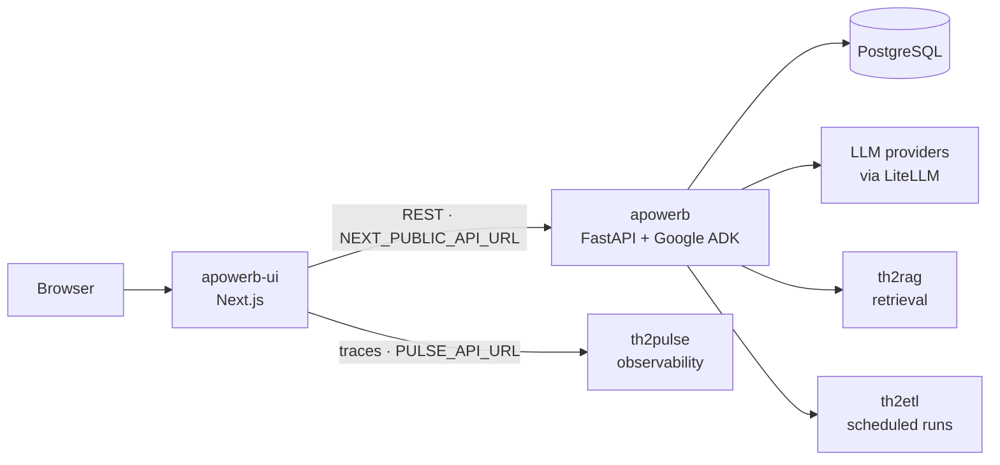

# apowerb-ui

The web interface for [**apowerb**](https://github.com/apowerb/apowerb) — build an agent,
give it tools and knowledge, run it, and watch what it did.

apowerb is an agentic framework: a REST API that stores agents, builds them on Google ADK
and runs them. This repository is the front end that makes it usable by someone who is not
going to write `curl` calls — the Studio. It talks to an apowerb instance over HTTP and
holds no business logic of its own.

Built with Next.js 16 (App Router), React 19 and Tailwind. Documentation:
[docs.apowerb.com](https://docs.apowerb.com).

## How it fits together



The interface never reaches the database or an LLM directly. Everything goes through the
apowerb API, which is what keeps this repository replaceable: a different front end against
the same API is a supported thing to build.

## What you can do in it

| Screen | What it is for |
| --- | --- |
| **Agents** | Create and configure agents: model, instruction, sub-agents, orchestration pattern |
| **Chat** | Talk to an agent, with responses streamed token by token |
| **Tool box** | Attach tools to an agent and configure each one (a database, a Drive folder, a key) |
| **Integrations** | Connect Google, Microsoft and GitHub accounts through OAuth |
| **Marketplace** | Publish an agent, or clone one published by someone else |
| **BI** | Build dashboards and charts from your data, and export them |
| **Orchestrator** | Schedule runs, and see what a schedule produced |
| **Webhooks** | Trigger an agent from an incoming event, such as a new email |
| **Supervision** | Audit sessions: what ran, for whom, how many steps, whether it errored |
| **Logging** | Read the run trace of a single session, step by step |
| **Billing** | Credit balance and purchases *(needs the billing brick — see Editions)* |

Dedicated chatbot routes ship for two common cases: retrieval over your documents
(`/chatbot/rag`) and natural-language querying of a database (`/chatbot/text-to-sql`).

The interface is available in **English and French** (`next-intl`, `messages/`), and follows
the system light or dark theme.

## Getting started

You need Node.js 22 — the version the Docker build uses.

```bash
npm install
cp .env.example .env.local   # then edit it, see Configuration below
npm run dev
```

Open <http://localhost:3000>.

### Just want to look around?

Set `NEXT_PUBLIC_USE_MOCK_AUTH=true` in `.env.local` and the SDK answers with a mock instead
of calling a server. You get the interface with no backend at all — enough to see the screens
and click through them.

For anything real, you need a **running apowerb instance**: this front end holds no business
logic, it only calls the API. Bring one up with
[Installation](https://docs.apowerb.com/installation) or the Docker Compose path in the
[Quickstart](https://docs.apowerb.com/quickstart), then point `NEXT_PUBLIC_API_URL` at it.

### Configuration

| Variable | Where it is read | What it points at |
| --- | --- | --- |
| `NEXT_PUBLIC_API_URL` | browser | Your apowerb instance, e.g. `http://localhost:8000` |
| `API_URL` | server | Same instance, for server-side calls. Lets you keep the API off the public network |
| `PULSE_API_URL` | server | th2pulse, for run traces. Optional |
| `NEXT_PUBLIC_AUTH_DISABLE_BASIC` | browser | Hides the email/password form — for a deployment that signs in another way |
| `NEXT_PUBLIC_AUTH_DISABLE_SIGNUP` | browser | Hides self-service account creation |
| `NEXT_PUBLIC_USE_MOCK_AUTH` | browser | `true` makes the SDK answer with a mock instead of calling the API. For looking around without a backend — never in a deployment |

The two `AUTH_DISABLE_*` switches only change what the interface *offers*. What is actually
allowed is decided by the API (`AUTH_BASIC_ENABLED`, `AUTH_REGISTER_ENABLED`); set them on
both sides or the interface will offer a door the server refuses.

### Docker

```bash
docker build -t apowerb-ui .
docker run -p 3000:3000 -e NEXT_PUBLIC_API_URL=http://host.docker.internal:8000 apowerb-ui
```

## The SDK

`packages/apowerb-sdk` is the typed client this interface uses to call the API — auth, agents,
runs, streaming, RAG, artifacts. It is published as `@apowerb/apowerb-sdk` and is worth
reaching for if you are writing your own front end or a Node script against an apowerb
instance, rather than re-deriving the endpoints by hand.

## Editions, and the extension slots

apowerb is an **open core**. The API ships as a complete, generic server, and some
capabilities — billing, usage metering, identity-provider sign-in, multi-factor
authentication, agent evaluation — are separate commercial bricks. They are *absent* from the
open-source build, not disabled: their routes answer `404`. See
[Editions and extensions](https://docs.apowerb.com/concepts/editions).

This interface mirrors that on the front end. `src/extensions/` holds a small registry: a
brick is an object with a `register(registry)` function, `Slot.jsx` marks the places in the
UI where one can insert something, and `installed.js` lists what is installed — **empty in
this repository**. So a screen whose capability is not in your edition simply has nothing to
show, and adding a brick does not mean forking the interface.

Where the API answers `404` because a capability is not in this edition, treat it as "not in
this edition", never as "broken" — the same rule as on the server side.

## Development

```bash
npm run dev          # dev server (Turbopack)
npm run build        # production build
npm run lint         # ESLint
npm test             # unit tests (Vitest)
npm run test:e2e     # end-to-end (Playwright)
```

Routes live in `src/app`, grouped by concern: `(dashboard)` for the signed-in application,
`(marketing)` for the public pages, plus the OAuth callback routes. Shared UI is in
`src/components`, API access in `src/lib`, React context in `src/contexts`.

## Screenshots

Not in the repository yet. Playwright is already configured here, which is the honest way to
produce them: drive a real instance and capture the screens, so the images cannot drift from
the product the way hand-picked screenshots do.

## License

MIT. See [LICENSE](./LICENSE).
